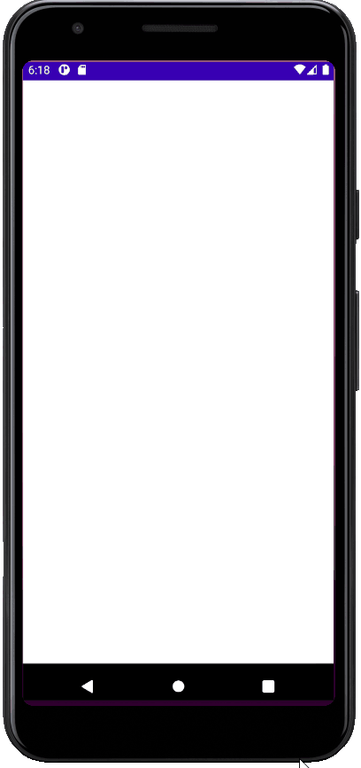

## Portfolio

---

### Main Proyects 

[Tercer Ojo](https://drive.google.com/file/d/1jiyhkCIRd9wTdX2ASREL40ajRrx3T_yP/view)
is a collection of 36 riddle games with creative uses of Android Services and resources, e.g., interacting with Clipboard System Service.

---
[Contado o Cuotas](https://github.com/BManchi/Contadoocuotas)
is a financial calculator to compare Cash versus Credit alternatives in a high inflationary economy through the calculation of Net Present Value financial formula.
Using AndroidX doAfterTextChanged() for fluent and responsive calculations.

---
[Developing](https://github.com/BManchi/Juego)
a text-based role-playing game with a complex history evolution and user interaction, all stored in a SQLite Database.

---

### Other relevant proyects

- [Task Timer](https://github.com/BManchi/TaskTimer) stores Tasks data in an SQLite database, recording how long it was spend in each task.
- [FlickrBrowser](https://github.com/BManchi/FlickrBrowser) queries Flickr.com images through Json.
- [Calculator](https://github.com/BManchi/Calculator) is developed with integrated keyboard wich adapts to screen size and rotation.

---

### Soft Competencies

- Teamwork
- Ability to work under preassure
- Adaptable/Flexible
- Honest
- Responsible
- Inventive/Curious

### Professional Culture

- Results Oriented
- Analytical
- Decisive
- Customer Oriented
- Efficient

---

 <a href="">evanca</a>

