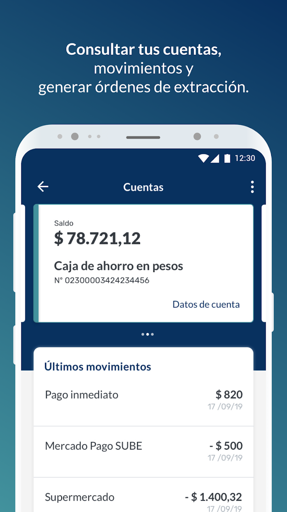

## Portfolio

---

### Main Proyects 

[Bankuish](https://www.bankuish.com/) 
is a startup that aims to solve the financial struggles of gig workers and the future of work solving the gap between the platforms that it's users use for work and the data and risk analysis that traditional financial entities use for their products. 

---
[New Horizon PPD for EntryReady](https://www.entryready.com/)
is an Admin tool to manage and setup EntryReady's system devices (IoT door locks) through the hardware supplier SDK for bluetooth connectiviy. 

---
[HomeBanking 3.0](https://play.google.com/store/apps/details?id=com.redlink.android_hb3.rioja)
is a white-label app used by several public and private banks in Argentina that leverages on product-flavor configs to customize the UI for each Client needs. 

 | La Rioja Bank | La Pampa Bank | Columbia | Montemar | 
 | -----------   |  ---------    | -----    | ------   |
 |    |    |    |    |

---
[Tercer Ojo](https://drive.google.com/file/d/1jiyhkCIRd9wTdX2ASREL40ajRrx3T_yP/view)
is a collection of 36 riddle games with creative uses of Android Services and resources, e.g., interacting with Clipboard System Service.

---
[Contado o Cuotas](https://github.com/BManchi/Contadoocuotas)
is a financial calculator to compare Cash versus Credit alternatives in a high inflationary economy through the calculation of Net Present Value financial formula.
Using AndroidX doAfterTextChanged() for fluent and responsive calculations.

---
[Developing](https://github.com/BManchi/Juego)
a text-based role-playing game with a complex history evolution and user interaction, all stored in a SQLite Database.

---

### Other relevant proyects

- [Task Timer](https://github.com/BManchi/TaskTimer) stores Tasks data in an SQLite database, recording how long it was spend in each task.
- [FlickrBrowser](https://github.com/BManchi/FlickrBrowser) queries Flickr.com images through Json.
- [Calculator](https://github.com/BManchi/Calculator) is developed with integrated keyboard wich adapts to screen size and rotation.

---

### Soft Competencies

- Teamwork
- Ability to work under pressure
- Adaptable/Flexible
- Honest
- Responsible
- Inventive/Curious

### Professional Culture

- Results Oriented
- Analytical
- Decisive
- Customer Oriented
- Efficient

---

 

